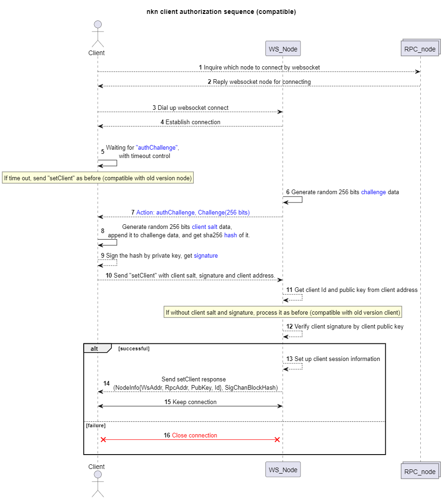

When a NKN client joins NKN network, it sends a RPC request to seed list to inquire which node that it should connect by webscoket.

After getting the websocket node information, the client connects to the node, and sends its client Id, public key to the node.

Then the node needs to check that the client is authorized to use this **client address** . This is what client authorization is for.

The main steps are here:
1. A client connects to a node by webscoket;
2. When getting a new connection from a client, the node generates 256 bit random data as a **challenge** , and send it to the client. This action is *authChallenge*;
3. After getting the challenge data, the client generates 256 bit random data as **client salt**, appends it to **challenge** data, and get sha256 **hash** of it;
4. The client signs the **hash** by its private key, gets a **signature**;
5. The client sends the **client salt**, **signature** and client address to the node. This action is *setClient*;
6. The node gets public key from the client address;
6. The node verifies the **signature** by the client public key;
7. If the verification is successful, the node keeps the connection, else the node **disconnects** the client. 

The authorization process is shown as following sequence chart:

